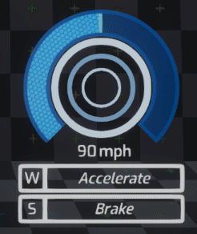
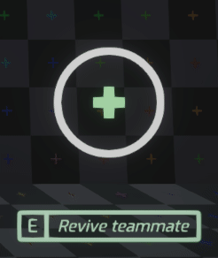

# RadialProgressBar [](http://adultlink.mit-license.org) [](https://www.paypal.me/adultlink/5usd)


This shader allows you to create shiny looking radial progress bars that can be used to display information like character HP, loading status, matchmaking rating progress, car speed, etc. The possibilities are endless.

THe shader can be edited through [Amplify Shader Editor](http://amplify.pt/unity/amplify-shader-editor) and contributions to the project are always welcome!

---

Project developed using **Unity 2017.4.8f1**. Please use this version if you are planning on contributing. You can work on your own branch and send a pull request with your changes.

---

_(Beware: The screenshots folder is quite heavy at the moment, I need to find a way to reduce file size for gifs without losing too much quality)_

You can also just download a **unitypackage** from the releases tab and easily import everything to your project. This will not download the _screenshots_ folder.

Disclaimer: The scripts controlling the behavior of the examples provided are not optimized in any way and should not only be taken as quick & dirty examples.

# Table of contents
1. [Getting started](#getting-started)
2. [Usage & parameters](#usage-and-parameters)
   - 2.1 [General settings](#general-settings)
   - 2.2 [Background settings](#background-settings)
   - 2.3 [Bar settings](#bar-settings)
3. [Examples](#examples)
4. [Parameters list](#parameters-list)
5. [Donate](#donate)
6. [License](#license)

# Getting started

To get this shader up and running you only need to attach it to a material, and drop that material onto a quad. That's it, you now have a basic HP Bar!


Best is to check the examples provided to get an idea on how to tweak the different parameters, and to take inspiration from them.

This shader comes in two variants; "standard" (the one that will be described here) and "simple". The second one is a simplified version of the first one, which does away with many of the settings.

# Usage and parameters

## General settings

These are settings that affect the whole bar, and they are pretty much self-explanatory. By increasing and decreasing `Fill percentage`, we control the amount of that bar that is filled. This is the main setting for this shader.


`Rotation` and `Arc range` (0-360) allows you to control the starting and ending angles.

## Background settings

"Background" will always be visible regardless of the fill percentage (unless you turn the opacity all the way down to 0, of course).


Here, we can set both the color for the "fill" area of the background, as well as for the border. Additionally, border radial (along the circle) and tangential widths can be set, as well as its opacity.

## Bar settings

This is the meat of the shader, and it is divided into two sections: `Border` and `Fill`. Border settings are very similar to the ones already described for the background, with the caveat that it is possible to specify a `Color (min)` and a `Color (max)`, so that the bar will lerp between them as is fills up.


Fill settings, on the other hand, are comprised of three more sections: `Main texture`, `Secondary texture` and `Noise texture`.

If you don't want to use any texture, just leave the slot empty.

They all provide similar parameters to play with, like `opacity` and `contrast`, `tiling` and `offset`. You can make these textures scroll or rotate (which is quite handy for a radial bar) via a dropdown button. Rotation/scrolling speed is customizable.

Again, bar color will lerp between min and max colors. If you don't want this to happen, simply give them both the same value.

It is important to note that the noise texture will be MULTIPLIED with the secondary texture, and the result will be ADDED to the main texture. This gives you some room to get creative.

# Examples

 


# Parameters list

<details><summary>"Standard version" - Click to expand</summary><p>

```C#

//MAIN SETTINGS
_Radius
_Arcrange
_Fillpercentage
_Globalopacity
_Rotation

//BACKGROUND
_Backgroundfillcolor
_Backgroundopacity
_Backgroundbordercolor
_Backgroundborderopacity
_Backgroundborderradialwidth
_Backgroundbordertangentwidth

//BAR - BORDER
_Bordermincolor
_Bordermaxcolor
_Mainbarborderopacity
_Mainborderradialwidth
_Mainbordertangentwidth

//BAR - MAIN TEXTURE
_Maintex
_Barmincolor
_Barmaxcolor
_Maintexopacity
_Maintexcontrast
_Invertmaintex
_Mainscrollrotate
_Maintexscrollspeed
_Maintexrotationspeed
_Maintextiling
_Maintexoffset

//BAR - SECONDARY TEXTURE
_Secondarytex
_Barsecondarymincolor
_Barsecondarymaxcolor
_Secondarytexopacity
_Secondarytexcontrast
_Invertsecondarytex
_Secondaryscrollrotate
_Secondarytexscrollspeed
_Secondarytexrotationspeed
_Secondarytextiling
_Secondarytexoffset

//BAR - NOISE TEXTURE
_Noisetex
_Noiseintensity
_Noisetexcontrast
_Invertnoisetex
_Noisetexspeed
_Noisetextiling
_Noisetexoffset

```

</p></details>

<details><summary>"Simplified version" - Click to expand</summary><p>
 
```C#

//MAIN SETTINGS
_Radius
_Arcrange
_Fillpercentage
_Globalopacity
_Rotation

//BAR
_Barmincolor
_Barmaxcolor
```

</p></details>

# Donate [](https://www.paypal.me/adultlink/5usd)

This piece of software is offered for free because I believe the gamedev community can benefit from it, and it should not be behind a paywall. I learned from the community, and now I am giving back.

If you would like to support me, donations are very much appreciated, since they help me create more software that I can offer for free.

Thank you very much :)

# License
MIT License

Copyright (c) 2018 Guillermo Angel

Permission is hereby granted, free of charge, to any person obtaining a copy
of this software and associated documentation files (the "Software"), to deal
in the Software without restriction, including without limitation the rights
to use, copy, modify, merge, publish, distribute, sublicense, and/or sell
copies of the Software, and to permit persons to whom the Software is
furnished to do so, subject to the following conditions:

The above copyright notice and this permission notice shall be included in all
copies or substantial portions of the Software.

THE SOFTWARE IS PROVIDED "AS IS", WITHOUT WARRANTY OF ANY KIND, EXPRESS OR
IMPLIED, INCLUDING BUT NOT LIMITED TO THE WARRANTIES OF MERCHANTABILITY,
FITNESS FOR A PARTICULAR PURPOSE AND NONINFRINGEMENT. IN NO EVENT SHALL THE
AUTHORS OR COPYRIGHT HOLDERS BE LIABLE FOR ANY CLAIM, DAMAGES OR OTHER
LIABILITY, WHETHER IN AN ACTION OF CONTRACT, TORT OR OTHERWISE, ARISING FROM,
OUT OF OR IN CONNECTION WITH THE SOFTWARE OR THE USE OR OTHER DEALINGS IN THE
SOFTWARE.
